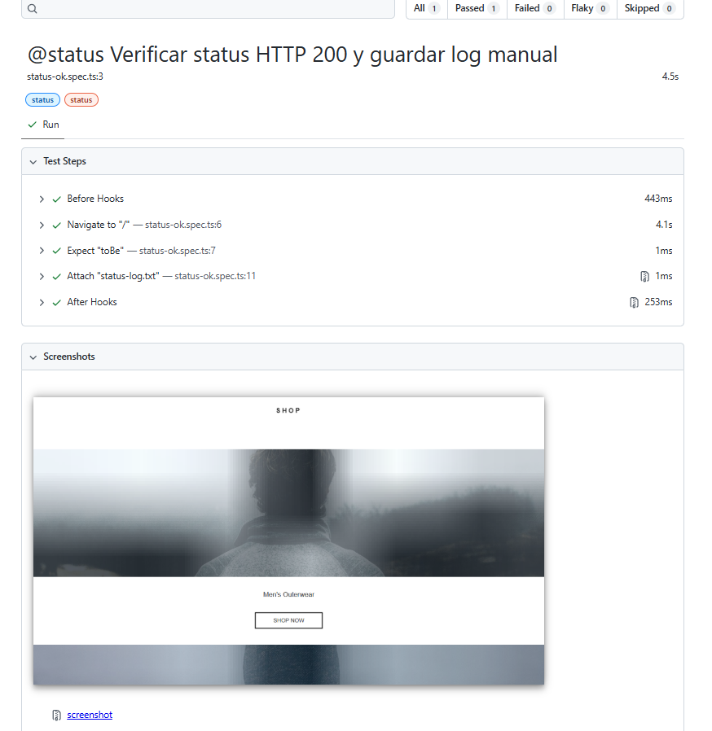
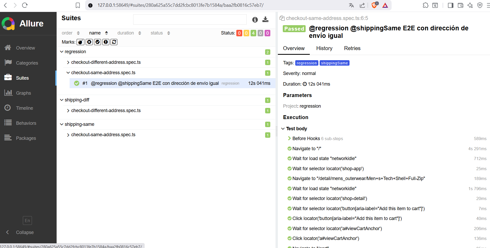

# 🧪 Playwright QA Automation – Polymer Shop

[English](#english) | [Español](#español)

---

## English

This project automates tests for the [Polymer Shop](https://shop.polymer-project.org) demo store using **Playwright**, with a clear risk-based strategy focused on critical user flows.

### 🧱 Tech Stack

- 🧪 **Playwright** - End-to-end testing framework
- 🧩 **Page Object Model (POM)** - Maintainable test architecture
- 📊 **Reports**: HTML + Allure
- ⚙️ **Test Tags**: By test type (`@status`, `@smoke`, `@regression`)
- 🔄 **CI/CD**: GitHub Actions pipeline

### 🧠 Testing Strategy

The goal is to validate the main purchase flow, prevent regressions, and prioritize critical functionality:

- ✅ Website availability
- 📦 Product loading
- 💳 Complete checkout process
- 🌐 Cross-browser compatibility

### 🧪 Implemented Tests

#### ✅ `@status` - Health Check
Verifies the website responds with `status 200`.

```typescript
const response = await page.goto('https://shop.polymer-project.org');
expect(response?.status()).toBe(200);
```

#### 🚀 `@smoke` - Critical Path
Ensures products load and add-to-cart functionality is available.

```typescript
await expect(page.locator('navigation')).toBeVisible();
await expect(page.locator('main')).toBeVisible();
await page.click('navigation a[href="/list/mens_outerwear"]');
```

#### 🔁 `@regression` `@shippingSame` - E2E Same Address
Complete flow from homepage to checkout using the same billing and shipping address.

#### 🔁 `@regression` `@shippingDiff` - E2E Different Address
Complete flow from homepage to checkout using different billing and shipping addresses.

## 📸 Evidencias

### ✅ Status Test (Playwright)



---

### 🚀 Smoke Test (Playwright)


---

### 🔁 E2E Checkout (Allure)



### ▶️ Execution Instructions

```bash
# Install dependencies
npm install
npx playwright install

# Run all tests
npm run test

# Run specific test suites
npm run test:regression     # E2E tests
npm run test:smoke         # Smoke tests
npm run test:same          # Same address checkout
npm run test:different     # Different address checkout

# View reports
npm run report             # HTML report
npx playwright show-report
```

### ✨ Contributors

- **Carolina Mas** - [GitHub](https://github.com/Carocitta)
- **Karisha Meléndez** - [GitHub](https://github.com/karisssha)
- **Eva Sisalli Guzmán** - [GitHub](https://github.com/miskybox)

---

## Español

Este proyecto automatiza pruebas sobre la tienda de ejemplo [Polymer Shop](https://shop.polymer-project.org) usando **Playwright**, con una estrategia clara basada en riesgo y flujos críticos de usuario.

### 🧱 Stack Técnico

- 🧪 **Playwright** - Framework de testing end-to-end
- 🧩 **Page Object Model (POM)** - Arquitectura de tests mantenible
- 📊 **Reportes**: HTML + Allure
- ⚙️ **Etiquetas de Test**: Por tipo (`@status`, `@smoke`, `@regression`)
- 🔄 **CI/CD**: Pipeline de GitHub Actions

### 🧠 Estrategia de Testing

El objetivo es validar el flujo principal de compra, prevenir regresiones y priorizar funcionalidad crítica:

- ✅ Disponibilidad de la web
- 📦 Carga de productos
- 💳 Proceso completo de checkout
- 🌐 Compatibilidad cross-browser

### 🧪 Tests Implementados

#### ✅ `@status` - Verificación de Salud
Verifica que la web responde con `status 200`.

```typescript
const response = await page.goto('https://shop.polymer-project.org');
expect(response?.status()).toBe(200);
```

#### 🚀 `@smoke` - Funcionalidad Crítica
Asegura que se cargan los productos y la funcionalidad de añadir al carrito está disponible.

```typescript
await expect(page.locator('navigation')).toBeVisible();
await expect(page.locator('main')).toBeVisible();
await page.click('navigation a[href="/list/mens_outerwear"]');
```

#### 🔁 `@regression` `@shippingSame` - E2E Misma Dirección
Flujo completo desde la página de inicio hasta checkout usando la misma dirección de facturación y envío.

#### 🔁 `@regression` `@shippingDiff` - E2E Dirección Diferente
Flujo completo desde la página de inicio hasta checkout usando direcciones diferentes de facturación y envío.

## 📸 Evidencias

### ✅ Status Test (Playwright)


---

### 🚀 Smoke Test (Playwright)


---

### 🔁 E2E Checkout (Allure)


### ▶️ Instrucciones de Ejecución

```bash
# Instalar dependencias
npm install
npx playwright install

# Ejecutar todos los tests
npm run test

# Ejecutar suites específicos
npm run test:regression     # Tests E2E
npm run test:smoke         # Tests smoke
npm run test:same          # Checkout misma dirección
npm run test:different     # Checkout dirección diferente

# Ver reportes
npm run report             # Reporte HTML
npx playwright show-report
```


### 📁 Estructura del Proyecto

```

### ✨ Desarrolladores

- **Carolina Mas** - [GitHub](https://github.com/Carocitta)
- **Karisha Meléndez** - [GitHub](https://github.com/karisssha)
- **Eva Sisalli Guzmán** - [GitHub](https://github.com/miskybox)

---

## 📝 License

This project is licensed under the MIT License - see the [LICENSE](LICENSE) file for details.

## 🤝 Contributing

1. Fork the project
2. Create your feature branch (`git checkout -b feature/AmazingFeature`)
3. Commit your changes (`git commit -m 'Add some AmazingFeature'`)
4. Push to the branch (`git push origin feature/AmazingFeature`)
5. Open a Pull Request

## 📞 Support

If you have any questions or issues, please open an issue on GitHub or contact the development team.